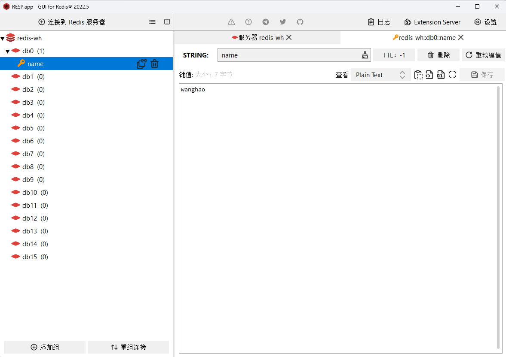

#                                                     <center>Redis学习笔记</center>

​																																																									by      王浩

# 一、Redis的概述

## 1、NoSQL的简介

### （1）NoSQL的定义

NoSQL(Not only SQL)是对不同于传统的关系数据库的数据库管理系统的统称，即广义地来说可以把所有不是关系型数据库的数据库统称为NoSQL。NoSQL 数据库专门构建用于特定的数据模型，并且具有灵活的架构来构建现代应用程序。NoSQL 数据库使用各种数据模型来访问和管理数据，这些类型的数据库专门针对需要大数据量、低延迟和灵活数据模型的应用程序进行了优化，这是通过放宽其他数据库的某些数据一致性限制来实现的。NoSQL数据库是为满足云计算的需求而设计的，采用与关系型数据库不同的方式来存储、分布和获取数据，它突破了传统关系型数据库对规模、性能、数据模型和数据分布的限制。

### （2）NoSQL的类型

* 键值数据库

键值数据库是一种非关系数据库，它使用简单的键值方法来存储数据。键值数据库将数据存储为键值对集合，其中键作为唯一标识符。键和值都可以是从简单对象到复杂复合对象的任何内容。键值数据库是高度可分区的，并且允许以其他类型的数据库无法实现的规模进行水平扩展。redis就是一种键值数据库。

* 内存数据库

通过存储在内存中来获取更高的性能，游戏和广告技术应用程序具有排行榜、会话存储和实时分析等都是内存使用案例，它们需要微秒响应时间并且可能随时出现大规模的流量高峰。

* 文档数据库

文档数据库是一种非关系数据库，旨在将数据作为类JSON文档存储和查询。文档数据库让开发人员可以使用他们在其应用程序代码中使用的相同文档模型格式，更轻松地在数据库中存储和查询数据。文档和文档数据库的灵活、半结构化和层级性质允许它们随应用程序的需求而变化。文档模型可以很好地与目录、用户配置文件和内容管理系统等使用案例配合使用，其中每个文档都是唯一的，并会随时间而变化。文档数据库支持灵活的索引、强大的临时查询和文档集合分析。

* 图形数据库

图形数据库旨在轻松构建和运行与高度连接的数据集一起使用的应用程序。图形数据库的典型使用案例包括社交网络、推荐引擎、欺诈检测和知识图形。热门图形数据库包括Neo4j和Giraph。图形数据库专门用于存储和导航关系。关系是图形数据库中的一等公民，图形数据库的大部分价值都源自于这些关系。图形数据库使用节点来存储数据实体，并使用边缘来存储实体之间的关系。边缘始终有一个开始节点、结束节点、类型和方向，并且边缘可以描述父子关系、操作、所有权等。一个节点可以拥有的关系的数量和类型没有限制。

图形数据库中的图形可依据具体的边缘类型进行遍历，或者也可对整个图形进行遍历。在图形数据库中，遍历联结或关系非常快，因为节点之间的关系不是在查询时计算的，而是留存在数据库中。在社交网络、推荐引擎和欺诈检测等使用案例中，需要在数据之间创建关系并快速查询这些关系，此时，图形数据库更具优势。

* 搜索数据库

搜索引擎数据库是一种非关系数据库，专用于数据内容的搜索。搜索引擎数据库使用索引对数据之间的相似特征进行分类，并增强搜索功能。搜索引擎数据库经过优化，可处理可能是长数据，半结构数据或非结构数据的数据，并且它们通常提供专门的方法，例如全文搜索，复杂的搜索表达式和搜索结果排名。

### （2）NoSQL和SQL的比较

| 区别     | SQL                                                        | NoSQL                                                        |
| -------- | ---------------------------------------------------------- | ------------------------------------------------------------ |
| 结构性   | 结构化                                                     | 非结构化                                                     |
| 关联性   | 关联                                                       | 无关联                                                       |
| 查询方式 | SQL查询语句                                                | 非SQL                                                        |
| 事务特性 | ACID                                                       | BASE                                                         |
| 存储     | 磁盘                                                       | 内存                                                         |
| 性能     | 取决于磁盘，要获得最佳性能需要优化查询、索引和表结构       | 由网络延迟、底层硬件集群、调用应用程序决定                   |
| 扩展性   | 增加计算能力纵向扩展或通过只读工作负载添加副本进行横向扩展 | 通过使用分布式体系结构进行横向扩展提高吞吐量                 |
| 使用场景 | 数据结构稳定，相关业务对数据的安全性和一致性要求高         | 数据结构不固定，对数据的安全性和一致性要求不高，对读写性能要求高 |

## 2、Redis的简介

redis是一个key-value存储系统。和Memcached类似，它支持存储的value类型相对更多，包括string(字符串)、list(链表)、set(集合)、zset(sorted set --有序集合)和hash（哈希类型）。这些数据类型都支持push/pop、add/remove及取交集并集和差集及更丰富的操作，而且这些操作都是原子性的。在此基础上，redis支持各种不同方式的排序。与memcached一样，为了保证效率，数据都是缓存在内存中。区别的是redis会周期性的把更新的数据写入磁盘或者把修改操作写入追加的记录文件，并且在此基础上实现了master-slave(主从)同步。

Redis 是一个高性能的key-value数据库。 redis的出现，很大程度补偿了memcached这类key/value存储的不足，在部 分场合可以对关系数据库起到很好的补充作用。它提供了Java，C/C++，C#，PHP，JavaScript，Perl，Object-C，Python，Ruby，Erlang等客户端，使用很方便。

Redis支持主从同步。数据可以从主服务器向任意数量的从服务器上同步，从服务器可以是关联其他从服务器的主服务器。这使得Redis可执行单层树复制。存盘可以有意无意的对数据进行写操作。由于完全实现了发布/订阅发布机制，使得从数据库在任何地方同步树时，可订阅一个频道并接收主服务器完整的消息发布记录。同步对读取操作的可扩展性和数据冗余很有帮助。

## 3、Redis的特点

### （1）功能丰富

键值（key-value）型，value支持多种不同的数据结构，如string、hashes、list等等。

### （2）原子性

单线程，每个命令具有原子性，支持事务。

### （3）低延迟，速度快

基于内存的存储，IO多路复用，良好的编码，由C编写，读写速度分别达到10万/20万。

### （4）数据持久化

支持定时的向磁盘备份数据，以保持持久化。

### （5）数据备份

主从集群、分片集群，master-slave模式的数据备份。

### （6）支持多语言客户端

支持多种语言开发，java，python等等。

## 4、Redis的学习网站

https://redis.io/docs/getting-started/


# 二、Redis的安装部署（docker-compose）

## 1、编写docker-compose.yaml

```yaml
	version: "3"
services:
  redis-wh:
    container_name: redis-wh
    image: redis
    ports:
      - "16379:6379"
    volumes:
    #配置文件映射到容器中
      - ./config:/opt/config
      - ./data:/data
    #指定配置文件启动redis
    command: redis-server /opt/config/redis.conf
```

## 2、编写配置文件

```conf
# 开启 AOF 持久化
appendonly yes

# 指定 AOF 文件名
appendfilename "appendonly.aof"

# 密码配置
# requirepass 123456

# 数据库数量，默认是16，0-15
# database 1

# 指定 AOF 文件保存目录
dir /data

# 关闭 RDB 持久化
save ""
# 开启 RDB 持久化
#save 900 1
#save 300 10
#save 60 10000

# 禁用 Redis 的保护模式，允许外部连接
protected-mode no

# 允许其他服务访问
bind 0.0.0.0

# 指定 Redis 监听的端口
port 6379

# 指定日志生成的文件
#logfile /var/log/redis/redis.log
```

## 3、启动redis服务

### （1）查看容器

容器已经起来了，日志显示正常。

```shell
(base) root@geodev-001:/mnt/data/wanghao02/redis# docker ps | grep redis-wh
044bc3f5dc1f   redis                                   "docker-entrypoint.s…"   29 seconds ago   Up 29 seconds   0.0.0.0:16379->6379/tcp, :::16379->6379/tcp                                                                                                                                                      redis-wh

(base) root@geodev-001:/mnt/data/wanghao02/redis# docker logs -f redis-wh
1:C 14 Sep 2023 06:30:29.556 # oO0OoO0OoO0Oo Redis is starting oO0OoO0OoO0Oo
1:C 14 Sep 2023 06:30:29.556 # Redis version=7.0.12, bits=64, commit=00000000, modified=0, pid=1, just started
1:C 14 Sep 2023 06:30:29.556 # Configuration loaded
1:M 14 Sep 2023 06:30:29.557 * monotonic clock: POSIX clock_gettime
1:M 14 Sep 2023 06:30:29.592 * Running mode=standalone, port=6379.
1:M 14 Sep 2023 06:30:29.592 # Server initialized
1:M 14 Sep 2023 06:30:29.592 # WARNING Memory overcommit must be enabled! Without it, a background save or replication may fail under low memory condition. Being disabled, it can can also cause failures without low memory condition, see https://github.com/jemalloc/jemalloc/issues/1328. To fix this issue add 'vm.overcommit_memory = 1' to /etc/sysctl.conf and then reboot or run the command 'sysctl vm.overcommit_memory=1' for this to take effect.
1:M 14 Sep 2023 06:30:29.596 * Reading RDB base file on AOF loading...
1:M 14 Sep 2023 06:30:29.596 * Loading RDB produced by version 7.0.12
1:M 14 Sep 2023 06:30:29.596 * RDB age 3186279 seconds
1:M 14 Sep 2023 06:30:29.596 * RDB memory usage when created 0.82 Mb
1:M 14 Sep 2023 06:30:29.596 * RDB is base AOF
1:M 14 Sep 2023 06:30:29.596 * Done loading RDB, keys loaded: 0, keys expired: 0.
1:M 14 Sep 2023 06:30:29.596 * DB loaded from base file appendonly.aof.1.base.rdb: 0.001 seconds
1:M 14 Sep 2023 06:30:29.597 * DB loaded from incr file appendonly.aof.1.incr.aof: 0.000 seconds
1:M 14 Sep 2023 06:30:29.597 * DB loaded from append only file: 0.001 seconds
1:M 14 Sep 2023 06:30:29.597 * Opening AOF incr file appendonly.aof.1.incr.aof on server start
1:M 14 Sep 2023 06:30:29.597 * Ready to accept connections
```

### （2）命令行查看redis

安装redis-cli并连接redis。

```shell
(base) root@geodev-001:~# redis-cli -h 127.0.0.1  -p 16379
127.0.0.1:16379> ping
PONG
127.0.0.1:16379> set name wanghao
OK
127.0.0.1:16379> get name
"wanghao"
```

### （3）可视化工具查看redis

下载安装并使用RESP工具连接redis，连接正常，可以查看到添加进去的键值对。




# 三、Redis的数据结构


# 四、Redis的使用命令

## 1、通用命令

### （1）查看通用命令

使用help命令可以查看通用命令的类型

```shell
127.0.0.1:16379> help @generic
```

### （2）keys

查找符合表达式的所有key，不建议在生产环境的主节点中使用，会阻塞线程

* 查看所有的key

```shell
127.0.0.1:16379> KEYS *
1) "address"
2) "name"
```

* 查看具体的的key

```shell
# 键值对存在
127.0.0.1:16379> KEYS name
1) "name"

#键值对不存在
127.0.0.1:16379> KEYS age
(empty list or set)
```

* 根据正则匹配查看key

```

```


### （3）DEL

### （4）EXISTS

### （5）EXPRIRE

### （6）TTL